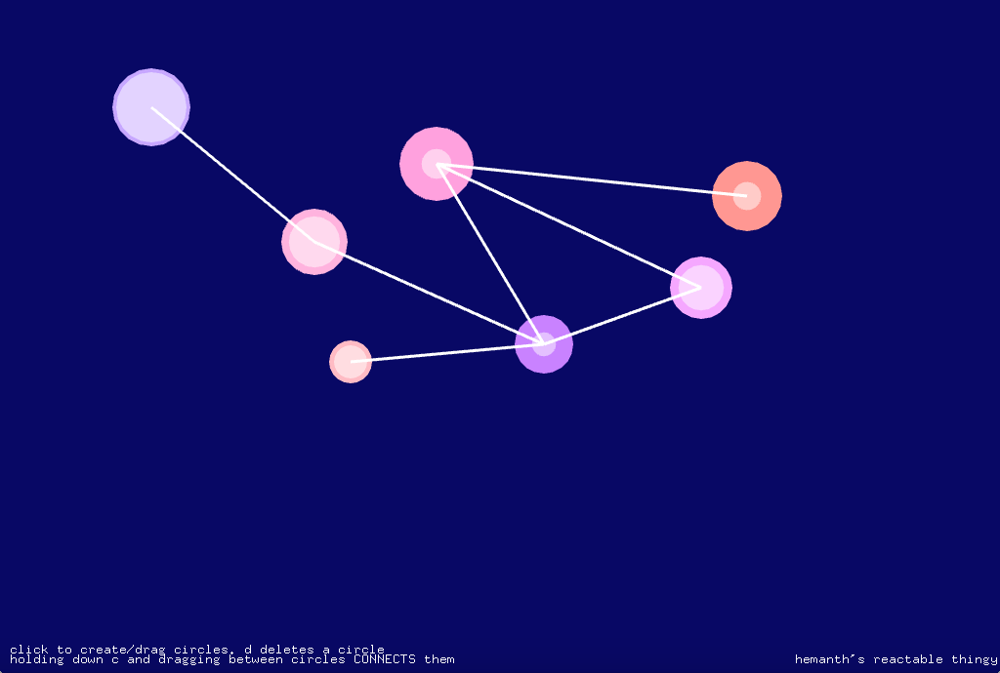

# CS476a-finalproject TITLE

Final project for Music 256a/CS 476a at Stanford. Inspired by the [Reactable](http://reactable.com) and [Deeply](https://ccrma.stanford.edu/~jfarman/256a/final.html). Still trying to nail down my own design and aesthetic for this project.

hkini [at] stanford

## Installation
Make sure you have OpenFrameworks installed, along with ofxStk.

1. Clone the repository.

2. Copy the rawwaves folder into bin/data of the project (see the ofxStk readme, on GitHub).

3. Compile.

4. Run the program once - you may not hear any sound. If so, in the setup() method in ofApp.cpp, make sure you’re selecting the right audio output device. (Running the app once will print your output devices to the console.) Note - there is no sound synthesis yet, so you definitely won’t hear anything.

5. Enjoy! (Further instructions are in the app.)

## Acknowledgements

I used and modified the openFrameworks starter code provided by Tim and Romain for drawing and artwork, and used ofxStk. The alpha-motion-blurring technique came from a tutorial online as well. Thanks also to Jennifer Farman for the inspiring Deeply, and to the Reactable team.

