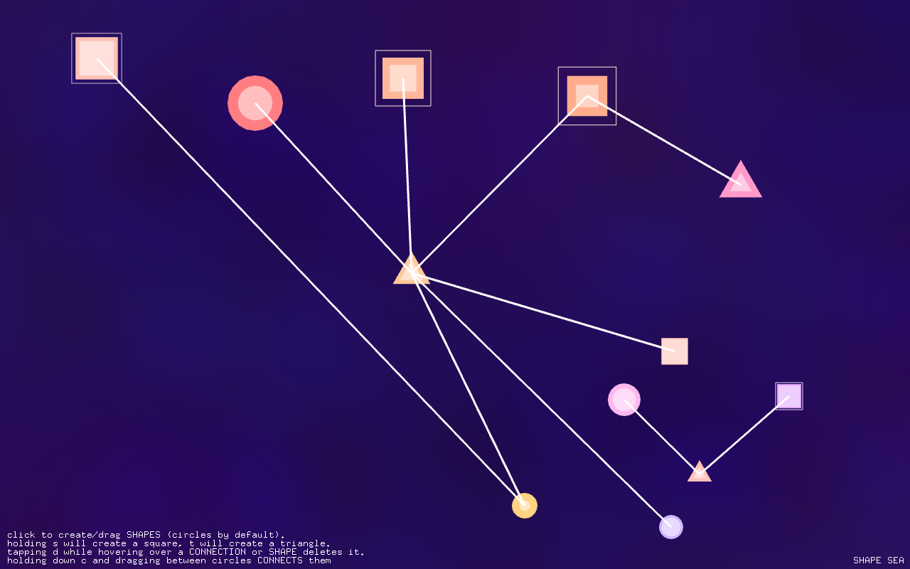

# Shape Sea

Play with shapes and sounds in a sea of muted colors. Inspired by the [Reactable](http://reactable.com) and [Deeply](https://ccrma.stanford.edu/~jfarman/256a/final.html). Final project for CS476a/MUS256a at Stanford’s CCRMA, fall of 2016.

Contact: hkini [at] stanford [dot] edu

## Installation
Make sure you have OpenFrameworks installed, along with ofxStk and ofxGLSLSimplexNoise.

1. Clone the repository.

2. Copy the rawwaves folder into bin/data of the project (see the ofxStk readme, on GitHub for more details).

4. Compile.

5. Run the program once - you may not hear any sound. If so, in the setup() method in ofApp.cpp, make sure you’re selecting the right audio output device. (Running the app once will print your output devices to the console.) Note - there is no sound synthesis yet, so you definitely won’t hear anything.

6. Enjoy! (Further instructions are in the app.)

## Acknowledgements

I used and modified the openFrameworks starter code provided by Tim and Romain for drawing and artwork, and used ofxStk for audio synthesis. The background was created with ofxGLSLSimplexNoise. I used additional smoothing code written by Romain. The alpha-motion-blurring technique came from a tutorial online as well. Thanks also to Jennifer Farman for Deeply, and to the Reactable team - both of which I drew inspiration from.

